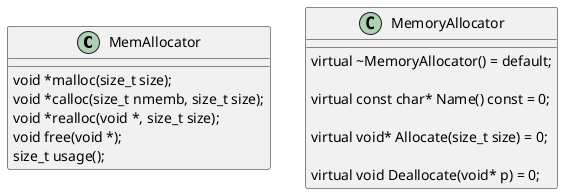

# Memory Allocator

Memory allocator is used to track the amount of memory used.

```plantuml
    @startuml memory_allocator
    class MemAllocator {
        void *malloc(size_t size);
        void *calloc(size_t nmemb, size_t size);
        void *realloc(void *, size_t size);
        void free(void *);
        size_t usage();
    }

    class MemoryAllocator {
        virtual ~MemoryAllocator() = default;

        virtual const char* Name() const = 0;

        virtual void* Allocate(size_t size) = 0;

        virtual void Deallocate(void* p) = 0;
    }

'   virtual size_t UsableSize(void* /*p*/, size_t allocation_size) const {
'     return allocation_size;
'   }


    @enduml
```